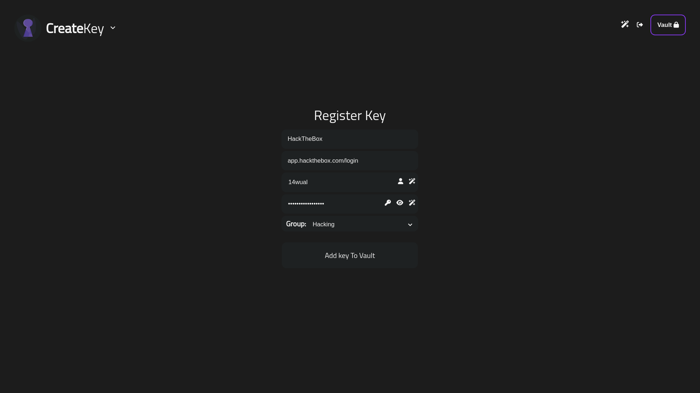
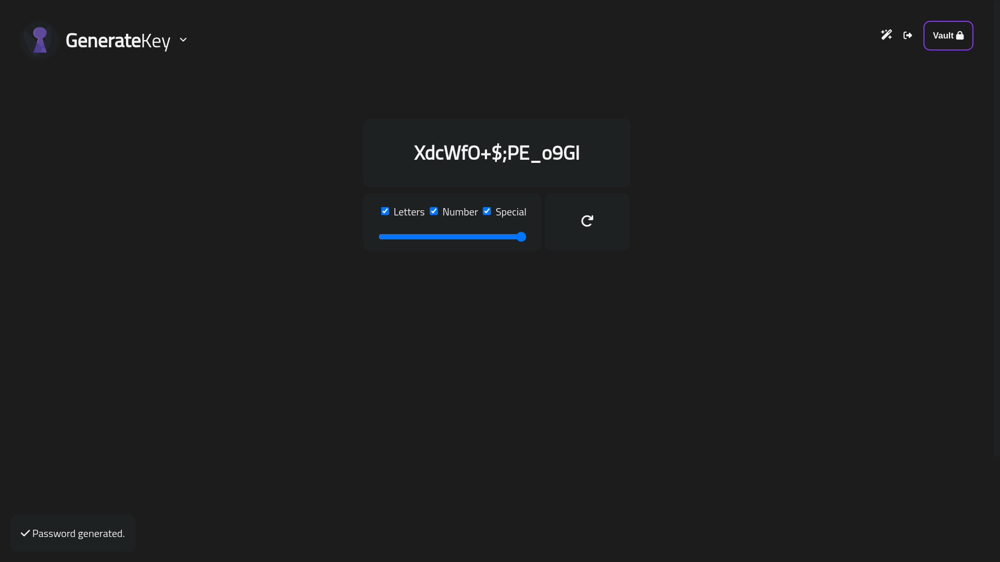

# VKM V5.0

<p align="center"></p>

<div align="center">
  
  
  
  
  
  
  
</div>

<br>

VKM V5.0.6 | 2023 Summer Review 1

**Description**: `A self-hosted indie password manager coded by wual`

**Page**: [https://14wual.github.com/vkm](https://14wual.github.io/vkm)

**Code**: [https://github.com/14wual/vkms](https://github.com/14wual/vkm)

**Download**: [Install](https://github.com/14wual/vkm/#Install)

**Wiki**: [https://github.com/14wual/vkm/wiki](https://github.com/14wual/vkm/wiki)

**Issues**: [https://github.com/14wual/vkm/issues](https://github.com/14wual/vkm/issues)

## Table of Contents 

1. [Install](https://github.com/14wual/vkm/#Install)
2. [Usage](https://github.com/14wual/vkm/#Usage) - Start Commands
3. [Usage](https://github.com/14wual/vkm/#vkm-app) - Api Usage
8. [Wiki](https://github.com/14wual/vkm/wiki)
8. [Pages](https://github.com/14wual/vkm/#Pages)
6. [Video & ScreenShots](https://github.com/14wual/vkm/#Gallery)
7. [AutoCompile](https://github.com/14wual/vkm/#AutoCompile)
5. [License](https://github.com/14wual/vkm/LICENSE)

[**Learn about VKM**](https://github.com/14wual/vkm/wiki)

What would you like to see in the future? [Open an Issue](https://github.com/14wual/vkm/issues)

**Important**

```
Vkm has been tested on Firefox and chronium-based browsers like Brave-browser
and Google Chrome. It is tested on Windows operating systems (10 and 11) and
Linux Debian (Debian, Kali) and Ubuntu. Using the default, xfce and bspwm window
managers.
```

```
It is important that if you decide to use VKM, keep in mind that making a copy
of the .kdbx file is not a bad idea and can prevent fatal damage.
```

## Install

### Option 1

*Version VKM V5.0 | NO Compiled*

**Linux**

```bash
pip install -U -r <(curl -sSL https://14wual.github.io/vkm/requirements.txt)
wget https://14wual.github.io/vkm/download/vkm5.tar.gz
```

**Windows** - PowerShell

```powershell
iex (irm -Uri 'https://14wual.github.io/vkm/requirements.txt' -UseBasicParsing).Content | pip install -U -r -
Invoke-WebRequest -Uri 'https://14wual.github.io/vkm/download/vkm5.zip' -OutFile 'vkm5.zip'
```

### Option 2 

*Complete VKM V5.0 Repository (source code and compiled)*

```bash
git clone https://github.com/14wual/vkm/
cd vkm/ && pip install -r requirements.txt
```

## Usage


```
python3 vkm.py # You should be in the vkm folder
```

### Start Commands

```txt
usage: vkm.py [-h] [-u USERNAME] [-p PORT] [-R]

options:
  -h, --help                        Show this help message and exitç
  -R, --register                    Go Register
  -p PORT, --port PORT              Select VKM boot port
  -u USERNAME, --username USERNAME  Go Login
```

### VKM App

Vkm *default* `http server port` is `1014`, `fastapi server` *default* `port` is `1015`.

**Register** - Page: `http://localhost:1014/register`


**NavBar**


**Vault** - Page: `http://localhost:1014/vault`


**Edit Key/Group** - Page: `http://localhost:1014/edit?args...`


**Generate Password** - Page: `http://localhost:1014/generate`


## Pages

```
VKM
├───create
├───edit
├───generate
├───login
├───register
├───search
├───show
└───vault
```

## Auto Compile

```
pyinstaller --noconfirm --onedir --windowed --icon "<path>/vkm/images/logo.ico" --name "vkm" --debug "all" --add-data "<path>/vkm/index.html:." --add-data "<path>/vkm/create:create/" --add-data "<path>/vkm/ddbb:ddbb/" --add-data "<path>/vkm/ddbb/kdbx:kdbx/" --add-data "<path>/vkm/edit:edit/" --add-data "<path>/vkm/generate:generate/" --add-data "<path>/vkm/images:images/" --add-data "<path>/vkm/login:login/" --add-data "<path>/vkm/register:register/" --add-data "<path>/vkm/search:search/" --add-data "<path>/vkm/show:show/" --add-data "<path>/vkm/vault:vault/" --add-data "<path>/vkm/modules:modules/"  "<path>/vkm/vkm.py"
```

## Gallery

### ScreenShots

**Main Vault** - Screenshot


**Registering Password** - Screenshot



**Generating Password** - Screenshot



### WualPK Video

**Not available**

## Technologies

1. Python
2. FastApi
3. JavaScript
4. KDBX - KeePass
5. HTML
6. CSS
